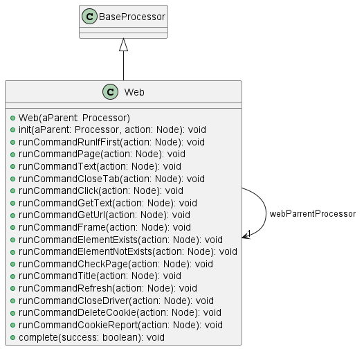

# Web Anteater Plugin

## Overview

The **Web Anteater Plugin** extends the functionality of Anteater to manage and interact with web browsers for automation and business workflows using Anteater recipes. The plugin provides a set of browser control commands designed for tasks such as navigating webpages, interacting with UI elements, verifying page properties, and more.

Anteater uses **recipe tags** based on the method names of the processor. Tags are derived from the `runCommand<TagName>` methods, with the prefix removed and the first letter converted to **Capital case**. For example:
- `runCommandPage` becomes `<Page>`
- `runCommandClick` becomes `<Click>`

These recipe tags allow users to define workflow steps directly in Anteater recipes using intuitive XML commands.

## Features

Key features include:
1. **Browser Interaction**:
   - Manage browser-based workflows such as clicking elements, navigating URLs, inspecting page properties, and checking element existence.
2. **UI Automation**:
   - Define Anteater recipes for testing UI workflows or performing repetitive tasks on webpages.
3. **Driver Management**:
   - Supports driver-based browser control for Chrome, Firefox and MS Edge.

## Initial Attributes

| **Attribute Name** | **Value** | **Description** |
|--------------------|-----------|-----------------| 
| name 	             |           |                 |
| type               | "msedge","gecko","chrome" | |
| tab                |           |                 |

Additional attribute for driver types:

chrome:
| **Attribute Name** | **Value** | **Description** |
|--------------------|-----------|-----------------| 
| deviceName         |           |                 |

gecko:
| Variable Name | Default value | Description |
|---------------|---------------|-------------|
| FIREFOX_BINARY_PATH |         |             |

msedge: 
| **Attribute Name** | **Value** | **Description** |
|--------------------|-----------|-----------------| 
| mode               | iexplorer |                 |

default:
| **Attribute Name** | **Value** | **Description** |
|--------------------|-----------|-----------------| 
| driver             |         | driver class name |

Variable:
| Variable Name | Default value | Description |
|---------------|---------------|-------------|
| WEBDRIVER_PATH |              |             |
| WEB_DRIVER_TYPE |             |             |

Example:

```xml
<Extern tab="ms" class="Web" type="chrome" timeout="8000">
    ...
</Extern>
```

### **Recipe Commands**

Class Diagram



Below is the list of available recipe commands derived from `runCommand` methods in the Web processor:

#### **General Browser Commands**
1. **`<RunIfFirst>`**: Executes content only for the root Web processor.
    This tag is useful for operations that should only be executed once when the root Web processor is initialized.
    It ensures that specific actions—such as global browser setup—apply only to the main instance rather than nested or child processors.
2. **`<Page>`**: Loads a webpage based on a specified URL.
3. **`<CloseDriver>`**: Closes the browser driver once work is completed.

#### **Element Interaction Commands**
4. **`<Text>`**: Inputs text into a specified field on the webpage.
5. **`<Click>`**: Simulates clicking an element.
6. **`<GetText>`**: Retrieves the text content of an element on the page.

#### **Element Existence Verification Commands**
7. **`<ElementExists>`**: Checks whether a specified element exists on the page.
8. **`<ElementNotExists>`**: Verifies that an element does not exist on the page.

#### **Navigation and Page Commands**
9. **`<Title>`**: Retrieves the title of the webpage.
10. **`<CheckPage>`**: Validates specific properties of a webpage.
11. **`<Refresh>`**: Refreshes the current webpage in the browser.

#### **Frame and Tab Commands**
12. **`<Frame>`**: Switches to a specified iframe within the webpage.
13. **`<CloseTab>`**: Closes the currently active browser tab.

#### **Cookie Management Commands**
14. **`<DeleteCookie>`**: Deletes a specific cookie from the browser.
15. **`<CookieReport>`**: Generates a report of browser cookies for inspection.

### **Examples**

#### **Example 1: Loading a Page and Clicking a Button**
```xml
<Recipe name="LoadAndClick">
    <Extern tab="a" class="Web" timeout="6000">
        <Page url="https://example.com" />
        <Click xpath="//button[@id='submit']" />
    </Extern>
</Recipe>
```

#### **Example 2: Interacting with an Input Field**
```xml
<Recipe name="InputText">
    <Extern tab="a" class="Web" timeout="6000">
        <Page url="https://example.com/login" />
        <Text xpath="//input[@id='username']" value="TestUser" />
        <Click xpath="//button[@id='login']" />
    </Extern>
</Recipe>
```

#### **Example 3: Verifying Element Presence**
```xml
<Recipe name="VerifyElement">
    <Extern tab="a" class="Web" timeout="6000">
        <Page url="https://example.com/dashboard" />
        <ElementExists xpath="//div[@id='welcome-message']" />
    </Extern>
</Recipe>
```
## Requirements

### **Web Driver**
The Web Anteater Plugin requires web drivers to manage browser control. Supported browser drivers include:
- **Google ChromeDriver**: [ChromeDriver Downloads](https://chromedriver.chromium.org/downloads)
- **Mozilla GeckoDriver**: [GeckoDriver Releases](https://github.com/mozilla/geckodriver/releases)

Web drivers must be downloaded and unpacked into:
```
$HOME/anteater/plugins
```

### **Driver-Browser Compatibility**
- Ensure the browser driver matches the version of the browser installed.
- Keep web drivers updated to remain compatible with ongoing browser updates.

## Notes and Best Practices

1. **Prioritize API Usage**:
   - Use backend APIs for data manipulation where possible. UI automation should only be used for workflows requiring direct UI interaction.
   
2. **Third-Party Services**:
   - Automation for external services may be fragile due to layout changes or updates on pages that are out of your control.

3. **Driver Management**:
   - Regularly update browser drivers to ensure compatibility with the latest browser releases.

## Troubleshooting

If you encounter issues while using the Web Anteater Plugin:
1. Verify web drivers are correctly installed in `$HOME/anteater/plugins`.
2. Ensure the web driver version is compatible with the installed browser version.
3. Confirm the plugin JAR file is properly placed in the Anteater plugins folder.

For additional guidance, refer to the Anteater [troubleshooting guide](https://ganteater.com/troubleshooting.html).

